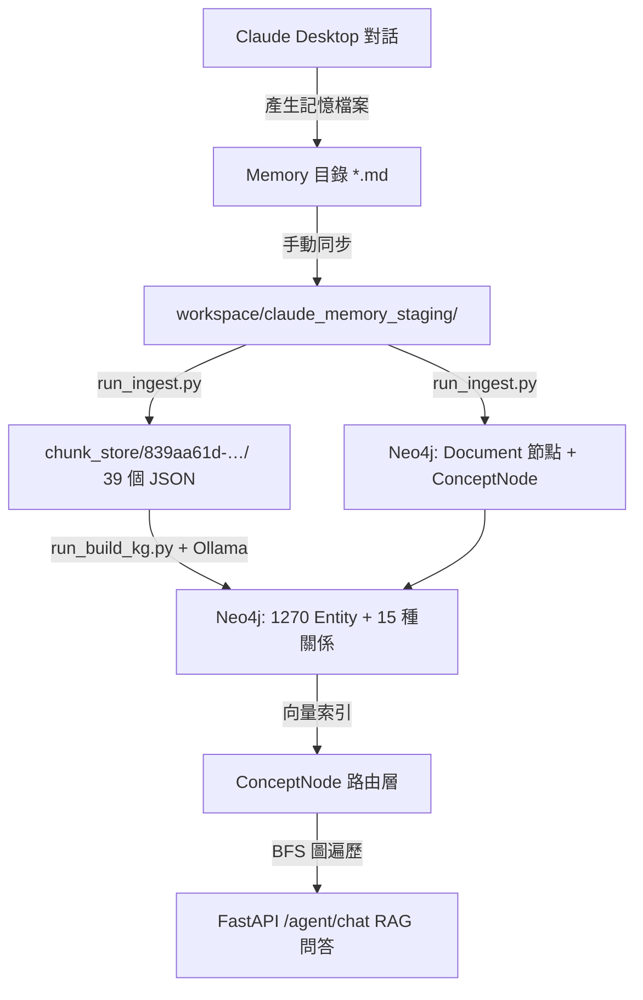

# Claude 對話記憶 (Memory) 導入智慧知識庫與知識圖譜建構任務書

本任務書旨在規劃將 `claude-desktop` 的對話記憶（一堆 Markdown 檔案）同步導入至「智慧知識庫」專案，利用 SVO（主詞-動詞-受詞）三元組技術將其轉化為結構化的知識圖譜（Knowledge Graph），並儲存於 Neo4j 資料庫中，以實現結構化的知識檢索與深度 RAG。

> **最後更新**：2026-06-28

---

## 關鍵參數

| 項目 | 值 |
|------|-----|
| KG ID | `839aa61d-8d97-4e2a-8c74-10fa111c3f38` |
| Neo4j DB 名稱 | `kgclaudeme5cff91a9` |
| Neo4j Browser | `http://localhost:7475` |
| FastAPI 端點 | `http://localhost:8000/agent/chat` |
| Staging 目錄 | `C:\Users\666\Desktop\智慧知識庫\workspace\claude_memory_staging\` |
| Chunk Store | `C:\Users\666\Desktop\智慧知識庫\chunk_store\839aa61d-8d97-4e2a-8c74-10fa111c3f38\` |
| LLM Provider | Ollama（本機，port 11434）|
| Embedding | sentence-transformers/paraphrase-multilingual-MiniLM-L12-v2（CUDA）|

---

## 1. 系統架構與資料流



---

## 2. 任務階段規劃與進度

### 階段一：資料源對接與同步機制 (Data Sync) ✅ 完成

* **目標**：批次將各專案 Memory 檔案同步至智慧知識庫的 ingestion 來源目錄。
* **實際執行**：
  - 來源路徑：`C:\Users\666\.claude\projects\<slug>\memory\`（多個專案）
  - 目標路徑：`workspace\claude_memory_staging\`
* **成果**：**34 個** `.md` 記憶檔案已同步，涵蓋 claude-desktop、RL、world-knowledge-hub 等多個專案的記憶與回饋記錄。

---

### 階段二：文件解析與 Chunk 切分 (Ingestion) ⚠️ 部分完成

* **目標**：將記憶文檔切分成 chunk 並持久化，同時在 Neo4j 寫入 Document 節點與 ConceptNode 向量索引。
* **實際執行**（2026-06-27 21:24）：
  ```powershell
  python run_ingest.py ".\workspace\claude_memory_staging" --kg 839aa61d-8d97-4e2a-8c74-10fa111c3f38
  ```
* **成果**：
  - ✅ `chunk_store/839aa61d-…/` 已生成 **39 個** chunk JSON 檔案
  - ❌ Neo4j `Document` 節點：**0**（程序在啟動時被 Ctrl+C 中斷，未完成寫入）
  - ❌ `ConceptNode` 向量索引：未建立
* **待辦**：補跑 Ingestion（見第 3 節 Todo #1）

---

### 階段三：SVO 提取與 Neo4j 知識圖譜建構 (Build KG) ✅ 完成

* **目標**：使用 Ollama LLM 提取概念與 SVO 三元組，寫入 Neo4j。
* **實際執行**（2026-06-28 13:45）：
  ```powershell
  python run_build_kg.py --kg 839aa61d-8d97-4e2a-8c74-10fa111c3f38
  ```
* **成果**（在 Neo4j DB `kgclaudeme5cff91a9` 驗證）：

  **Entity 節點：1,270 個，分 10 種類型**

  | 節點類型 | 說明 |
  |---------|------|
  | Entity | 通用實體 |
  | Concept | 概念 |
  | Algorithm | 演算法 |
  | Technology | 技術 |
  | Method | 方法 |
  | Tool | 工具 |
  | Framework | 框架 |
  | Model | 模型 |
  | System | 系統 |
  | Person | 人物 |

  **語意關係（15 種，部分數量）**

  | 關係 | 數量 |
  |------|------|
  | REQUIRES | 65 |
  | CAUSES | 54 |
  | HAS_PROPERTY | 31 |
  | IMPROVES | 27 |
  | DEFINED_AS | 25 |
  | … 其餘 10 種 | … |

---

### 階段四：RAG 整合與知識圖譜應用 (RAG Query) ❌ 尚未執行

* **目標**：透過 `POST /agent/chat` 進行帶有圖譜路由與 BFS 遍歷的問答，驗證能從對話記憶中精準召回資訊。
* **前置條件**：需先完成階段二補跑（Document + ConceptNode）
* **驗收測試指令**：
  ```powershell
  curl -X POST http://localhost:8000/agent/chat `
    -H "Content-Type: application/json; charset=utf-8" `
    -d "{\"question\":\"claude-desktop 的 Teams 系統如何運作？\",\"kg_id\":\"839aa61d-8d97-4e2a-8c74-10fa111c3f38\"}"
  ```
* **可選擴充**：為 `claude-desktop` 開發 MCP 伺服器，讓 Claude CLI 透過 Tool 直接查詢記憶圖譜。

---

## 3. 待辦任務清單 (Todo Checklist)

- [x] **建立同步指令與路徑配置**
  - [x] 確定匯入路徑（各專案 `~/.claude/projects/<slug>/memory/`）
  - [x] 於 Neo4j 中初始化 `claude_memory` 知識圖譜實例（DB: `kgclaudeme5cff91a9`）

- [x] **批次執行 Ingestion（chunk 建立）**
  - [x] `chunk_store/839aa61d-…/` 已生成 39 個 chunk JSON

- [ ] **#1 補跑 Ingestion（補建 Document + ConceptNode）**
  - [ ] 執行：`python run_ingest.py ".\workspace\claude_memory_staging" --kg 839aa61d-8d97-4e2a-8c74-10fa111c3f38`
  - [ ] 驗證：`MATCH (d:Document) RETURN count(d)` → 應為 34
  - [ ] 驗證：`CALL db.labels()` → 應出現 `Document`、`ConceptNode`

- [x] **執行 SVO 圖譜建構**
  - [x] LLM Provider 使用 Ollama（本機）
  - [x] 執行 `run_build_kg.py` 完成
  - [x] 驗證：Entity 節點 1,270 個，15 種語意關係

- [ ] **#2 RAG 檢索與對話驗證（等 #1 完成後執行）**
  - [ ] 執行驗收測試指令（見階段四）
  - [ ] 確認能從記憶圖譜正確召回 claude-desktop 相關知識
